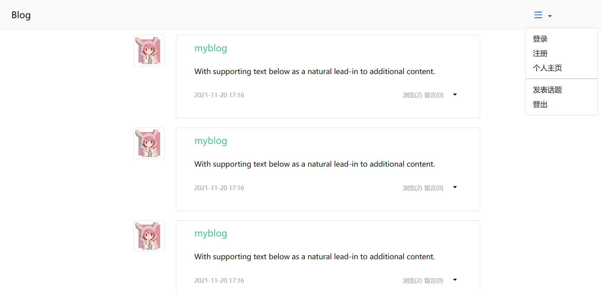
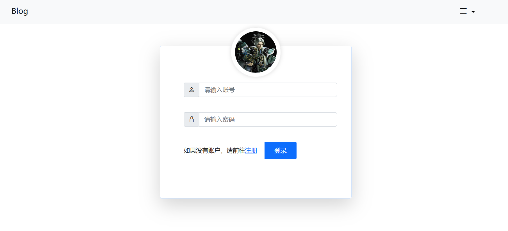
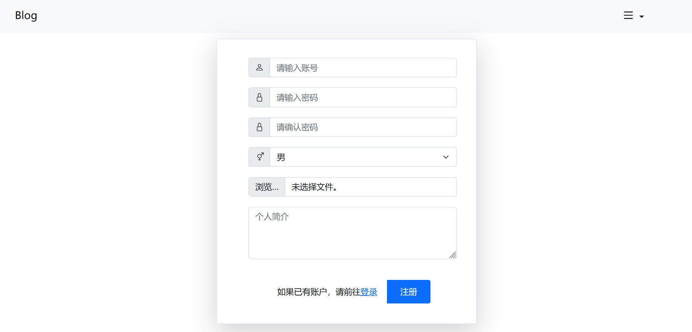
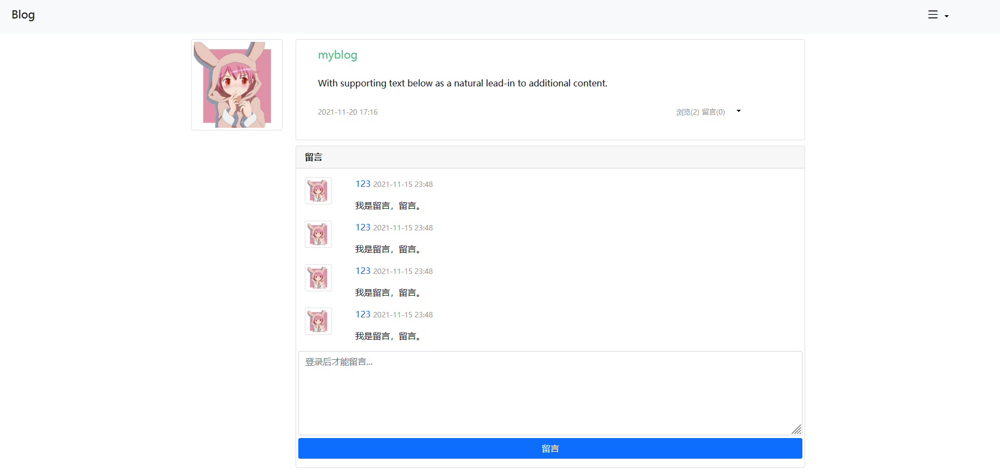
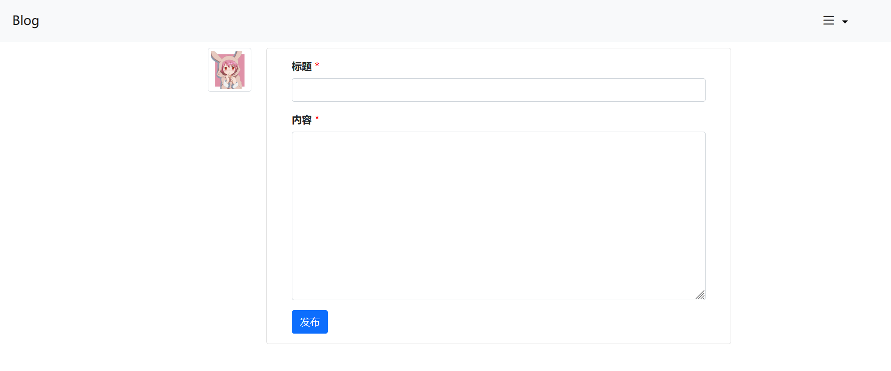

# 简易论坛

## 概述

仅是一个由Bootstrap写成的简易的论坛项目，为后端提供数据渲染的页面。

仅有五个前端html页面，可以结合后端写一个简单的增删改查项目。

也可以用于学习Bootstrap的使用。

## 技术栈

- HTML
- CSS
- JavaScript
- [Bootstrap](https://v5.bootcss.com/docs/5.1/getting-started/introduction/)

## 页面效果

- `index.html`：首页，显示所有用户发布的所有话题。

- `login.html`：登录页面，用户可输入账户和密码用于登录。

- `register.html`：注册页面，用户可输入账号、密码、性别、头像、个人简介来注册用户。

- `detail.html`：详细页，即话题的详情页，可以看到发布的话题信息，可以对话题进行编辑和删除。主要可以在该页进行留言。

- `publish.html`：发布话题页面，必须是登录用户。

